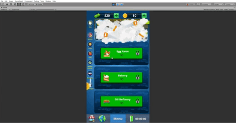
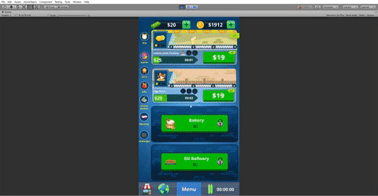
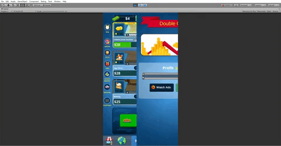

<h1>Business Tycoon: Idle Clicker Game</h1>

Welcome to Business Tycoon, the ultimate idle clicker game where you get to build your own business empire from scratch! Click your way to success by managing your businesses, expanding your portfolio, and investing in the stock market. With an interactive UI, daily challenges, and scriptable object based business and game entity configurations, you are in control of your own destiny.

<h2>Gameplay</h2>

In Business Tycoon, you start with a single business and work your way up the ladder to become the ultimate business tycoon. The game features manual clicking, but you can also hire in-game managers for auto clicks. You can expand your business by buying new businesses or upgrading existing ones to increase their revenue. As you progress, you will also have the opportunity to invest in the stock market to earn even more profit.

<h2>Features</h2>
<ul>
<li>Manual clicking</li>
<li>Hire in-game managers for auto clicks</li>
<li>Stock market to trade in-game currency to earn profit</li>
<li>Spin the wheel to earn cash</li>
<li>Interactive UI</li>
<li>Daily challenges</li>
<li>Scriptable object based business and game entity configurations</li>
<li>Unity ads integration</li>
</ul>
<h2>Getting Started</h2>

To get started, simply download the game from the GitHub repository and install it on your device. Once you launch the game, you will be taken to the main menu where you can start a new game, load an existing game, or access the game settings.

<h2>Scriptable Object Based Business and Game Entity Configurations</h2>

One of the unique features of Business Tycoon is the scriptable object based business and game entity configurations. This allows you to easily customize your game and add new businesses or game entities without having to write any code. Simply create a new scriptable object, add the necessary data fields, and attach it to your game entity.

<h2>Daily Challenges</h2>

Every day, Business Tycoon offers a new set of daily challenges for you to complete. These challenges will test your skills and reward you with in-game currency and other valuable items.

<h2>Unity Ads Integration</h2>

Business Tycoon also features Unity ads integration, allowing you to earn even more profit by watching ads.

<h2>Conclusion</h2>

In Business Tycoon, the sky is the limit. With manual clicking, auto clicks, stock market investments, and daily challenges, there is always something new to explore. So what are you waiting for? Download Business Tycoon today and start building your own business empire!

